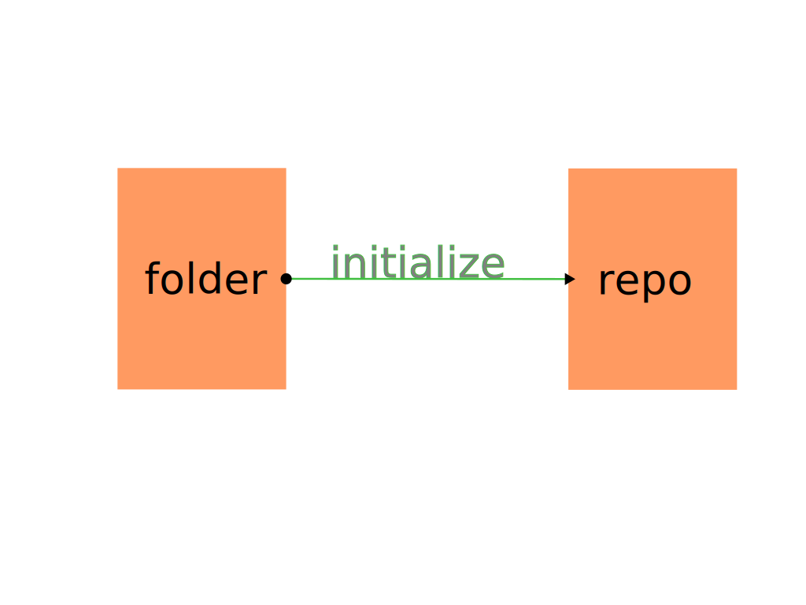

# Git - an introduction

First let's enjoy a story - [Git is like many pots of soup](https://zmcartor.github.io/git/2013/07/13/git-for-everyone).

I hope the story gave you an idea of how it works.

## History of Git

The development of Git began on 3 April 2005. It was originally authored by Linus Torvalds, the creator of Linux, to help him manage the development of the Linux kernel. It was initially released in 2005, under the GNU General Public License version 2.

## Scope of this resource

Instead of teaching you how to work with git on the command line, we will be discussing the concepts and the workflow.

If this is not what you are looking for, you can find other resources [here](https://git-scm.com/doc).

## How it works

Suppose you have a folder (a.k.a. directory) named `MyProject` with some files in it. You want git to manage it.  
For this you need to tell git to create (`initialize`) a git repository in the folder.

This will create a hidden folder named `.git` in the folder. This is the repository and it contains _almost_ everything git needs to know.

