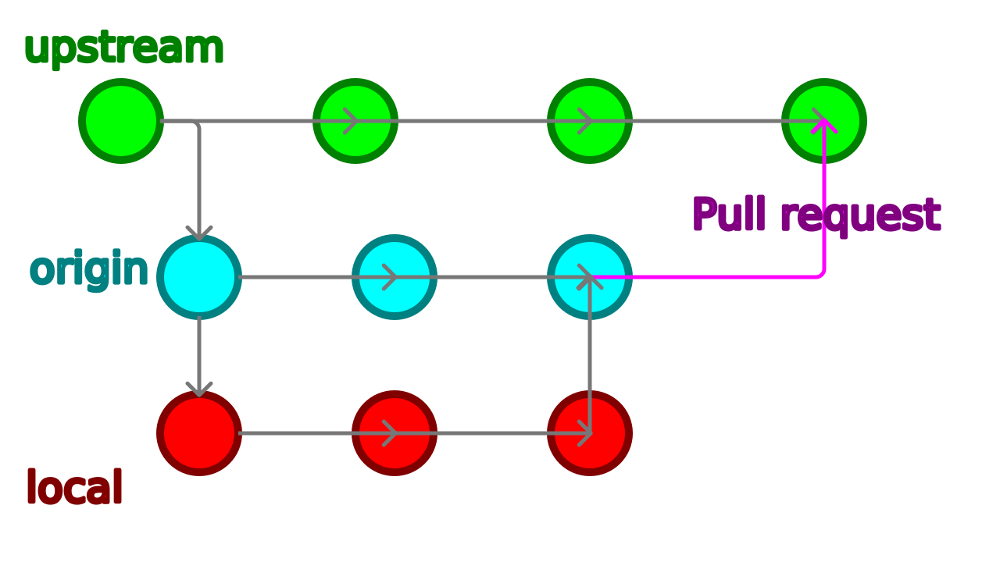

# Working remotely

Now that you have a basic understanding of git, you are probably feeling like a shark in a fishbowl.

> I have heard of people using git to contribute to open source projects and for collaboration, but am not sure how to do that.

Till now, you have been learning how to work with git on your local machine.  
In this chapter, you will learn how to work with remote repositories.

## Remote repositories

Remote repositories (`remotes`) are the repositories that are accessible over a network. They can exist somewhere on the internet, an office server or even your personal device. You can push to remote repositories to share your work with others and pull from them to get work from others.

When you clone a repository, you get a local repository with the remote repository added as a remote named `origin`. You can also add remotes to a local repository.

git supports the following operations on remotes:

- `fetch` - Downloads the latest changes from the remote repository.
- `pull` - Downloads the latest changes from the remote repository and merges them into the current branch. It is a combination of `fetch` and `merge`.
- `push` - Sends the latest changes from the current branch to the remote repository.

A remote repository can be hosted on a server or on a service like GitHub, GitLab, Bitbucket, etc.

Do not let the word `remote` confuse you. **You can have a repository on your local machine as a `remote`.** One use case for this would be if you want to keep a backup of your repository on a different or an external hard drive. See [this answer on StackOverflow](https://stackoverflow.com/a/34507038/8659747) for details.

## Collaboration

### Forking

Forking is a way to contribute to a project without having write access to the repository. _It is not a git feature, but a feature of various popular hosting services._

When you fork a repository, you create a copy of the repository on your account. You can then make changes to your copy. You can also send a pull request to the original repository, often referred to as the `upstream` repository, to contribute your changes.

### Cloning

While most popular hosting services provide a web interface for browsing and editing files, sometimes you might want to work offline on your local machine. If no web interface is available, this becomes a necessity.  
Instead of downloading the files and managing them manually, you can tell git to copy (`clone`) the repository.

To clone a repository, you need to tell git the URL of the remote repository and where you want git to create the local repository.

### Pull requests

Pull request -> A request to the owner of the upstream repository to pull your changes.

The owner/maintainer of the upstream repository can then review your changes and merge or reject them.

This concept is tied to forking. Hence, it is again not a git feature.

[Previous](./chapter3.md){: .btn} [About this guide](../ABOUT.md){: .btn}
